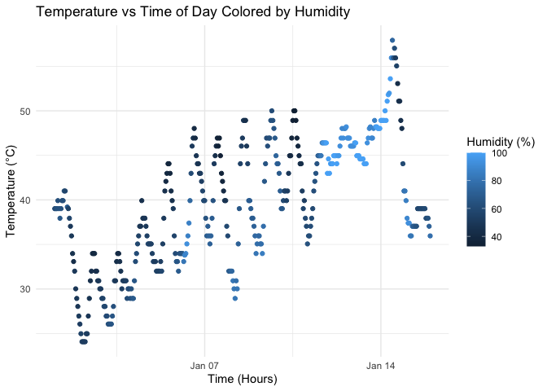

p8105_hw1_cl4773.Rmd
================
Clement Li
2025-09-17

#### Load the moderndive library, and use the following code to load the early_january_weather dataset:

``` r
library(moderndive)
data("early_january_weather")
```

#### The early_january_weather dataset has 358 rows and 15 columns. The variables include: time_hour: The hour of the day.

temp: Temperature in degrees Celsius. humid: Humidity percentage. Other
variables include wind speed, pressure, etc.

The mean temperature is 40 degrees Celsius.

#### Make a scatterplot of temp (y) vs time_hour (x); color points using the humid variable (adding color = … inside of aes in your ggplot code should help). Describe patterns that are apparent in this plot.

``` r
library(ggplot2)

p <- ggplot(early_january_weather, aes(x = time_hour, y = temp, color = humid)) +
  geom_point() +
  labs(title = "Temperature vs Time of Day Colored by Humidity",
       x = "Time (Hour)",
       y = "Temperature (°C)",
       color = "Humidity (%)") +
  theme_minimal()

print(p)
```

<!-- -->

#### Export your scatterplot to your project directory using ggsave.

``` r
ggsave(filename = "scatterplot_temp_vs_time.png", plot = p, width = 7, height = 5)
```
